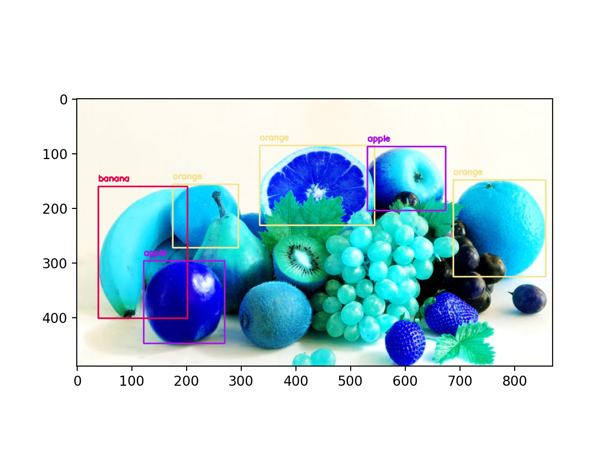

# **Object-Detector**
This simple application detects the different objects in any image.

### Python Libraries

- TensorFlow: [Install TensorFlow](https://www.tensorflow.org/install/pip)
- opencv-python: `pip install opencv-python`
- cvlib: `pip install cvlib`
- matplotlib: `pip install matplotlib`

### Results
Below is the result for my test image.

### Acknowledgement
Credit to [Shape AI](https://www.shapeai.tech/), I learned this through their [LinkedIn post](https://www.linkedin.com/feed/update/urn:li:activity:6687248391879057408/).
